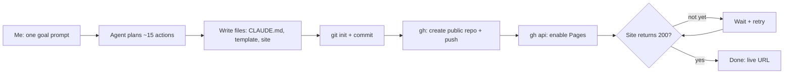

# Project 00: Portfolio Scaffold

> **One-line pitch:** a single goal-level prompt → a published portfolio repo, templates and live website, built and verified by the agent.

**Pattern:** Goal → multi-tool execution → self-verification
**Live demo:** https://machomono.github.io/agentic-orchestrator/
**Status:** done

---

## Problem
Every portfolio project needs the same setup: a repo, a consistent README format, a site to host demos, and standing instructions so the AI behaves the same way every session. Doing that by hand is 30+ minutes of clicking and typing. This project hands that whole job to an agent as one outcome.

## Agentic Pattern


## Demo
Live site: https://machomono.github.io/agentic-orchestrator/

## Prompts I Used
1. ```
   Build my portfolio scaffold here: git init, CLAUDE.md (I'm an AI Orchestrator; define new vocabulary; update projects/<name>/NOTES.md at the end of each session), a README template at templates/PROJECT_README.md with sections: Problem, Agentic Pattern (mermaid diagram), Demo, Prompts I Used, What the Agent Did, Results, Vocabulary, Lessons. Copy the approved plan from ~/.claude/plans/at-my-job-i-binary-unicorn.md to PLAN.md. Create a GitHub Pages landing page in docs/. Use gh to create a public repo "agentic-orchestrator", push, and enable Pages. Verify the site loads.
   ```

## What the Agent Did
| Step | Tool / action | Why |
|---|---|---|
| 0 | Checked `gh auth status`, git identity, existing repo name | Catch blockers *before* starting (found: git name missing, fixed first) |
| 1 | `git init -b main`, created folder structure | Workspace for all 11 projects |
| 2 | Wrote `CLAUDE.md` | Standing instructions loaded every session |
| 3 | Wrote `templates/PROJECT_README.md` | Makes every future project showcase-ready |
| 4 | Copied plan → `PLAN.md` | Roadmap lives with the code |
| 5 | Wrote `docs/index.html` | Landing page for GitHub Pages |
| 6 | Wrote root `README.md` and this project's README/NOTES | Portfolio front door |
| 7 | `git commit` | Snapshot |
| 8 | `gh repo create --public --push` | Publish |
| 9 | `gh api .../pages` (source: `main` `/docs`) | Turn on hosting |
| 10 | Polled the site URL until HTTP 200 | **Self-verification**: prove it, don't claim it |

## Results
- 1 prompt from me → ~12 tool calls by the agent
- Public repo + live website in a few minutes

## Vocabulary
| Term | Meaning |
|---|---|
| **CLAUDE.md** | A file Claude reads automatically at the start of every session in this folder. It holds standing instructions. |
| **gh CLI** | GitHub's command-line tool. It lets an agent create repos and configure Pages without a browser. |
| **GitHub Pages** | Free static-site hosting served straight from a folder in a repo (here, `docs/`). |
| **Mermaid** | Text-based diagrams that GitHub renders as pictures, like the one above. |
| **Polling** | Checking something repeatedly until it's ready. Used here to wait for Pages to go live. |
| **Self-verification** | The agent checks its own result against a concrete test (HTTP 200) before saying "done". |

## Lessons
- A **goal-level prompt** ("build X, publish it, verify it") gets far more done than step-by-step instructions.
- **Preflight checks** (auth, identity, name conflicts) prevent half-finished runs.
- "Verify it loads" is the most valuable phrase in the prompt. Without it, the agent would stop at "I enabled Pages" and never prove the site works.
