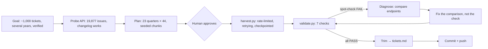

# Project 01: Jira Harvester

> **One-line pitch:** an agent harvests a stratified, validated, reproducible sample of 1,012 real Jira tickets, and catches and fixes its own validation failure along the way.

**Pattern:** Gather
**Data:** [`data/raw/kafka_issues.jsonl`](../../data/raw/kafka_issues.jsonl) · [`VALIDATION.md`](../../data/raw/VALIDATION.md) · [`tickets.md` digest](../../data/tickets.md)
**Status:** done

---

## Problem
Every knowledge project starts with getting the raw material out of the system where it lives. Doing it naively (grab the newest 1,000 tickets) gives a biased sample: it would all come from the last few months. And without checks, you never know whether the data is complete or silently truncated.

## Agentic Pattern


## Demo
```
$ python3 projects/01-jira-harvester/harvest.py
KAFKA: 23 quarters x 44 = up to 1012 issues (seed 42)
2021Q1:   455 issues in quarter -> sampled 44
...
2026Q3:   414 issues in quarter -> sampled 44
done: 1012 issues -> data/raw/kafka_issues.jsonl

$ python3 projects/01-jira-harvester/validate.py --target 1012
PASS  Total count: 1012 issues
PASS  Duplicate keys: 0 duplicates
PASS  Even spread across quarters: 23 quarters, 44–44 issues each
PASS  Required fields present
PASS  Comments not truncated: 0 truncated; 2117 comments total
PASS  Changelog not truncated: 0 truncated; 2558 status/assignee/resolution changes kept
PASS  Spot-check re-fetch: KAFKA-14431: match; KAFKA-20793: match; KAFKA-13464: match
OVERALL: ALL CHECKS PASS
```

## Prompts I Used
1. ```
   Goal: harvest ~1,000 KAFKA issues from the public Apache Jira REST API spanning several years into data/raw/ (key, summary, description, type, status, priority, components, labels, assignee, created, resolved, comments, changelog of status/assignee changes). Plan it, including how you'll verify completeness.
   ```
2. `go` (approving the plan: the human checkpoint)

## What the Agent Did
| Step | Tool / action | Why |
|---|---|---|
| 1 | Probed `/rest/api/2/search` with 2 issues | **Preflight**: confirm access, total count (19,877), and that comments + changelog come back in one call |
| 2 | Proposed a plan with 7 validation checks, then waited | Human checkpoint before spending effort |
| 3 | Wrote `harvest.py` | Stratified sampling (23 quarters × 44, 4 chunks per quarter at seeded-random offsets), 1 req/sec, exponential backoff, per-quarter checkpoints |
| 4 | Ran it: ~115 requests, 1,012 issues, 0 retries needed | The Gather step |
| 5 | Wrote and ran `validate.py` | **Self-verification** |
| 6 | ❌ Spot-check failed: `created` mismatched on 3/3 re-fetched issues | The check did its job |
| 7 | Diagnosed by fetching one issue from both endpoints | Found that `/search` returns `…18.000`, `/issue` returns `…18.105`: same moment, the search API drops milliseconds |
| 8 | Fixed the *comparison* (to the second), kept the check strict for every other field; re-ran → all PASS | Fix the root cause, never weaken the test to get green |
| 9 | Wrote `make_digest.py` → `data/tickets.md` | Removed code blocks and stack traces, capped descriptions and comments: **586K → 199K tokens (−66%)** for Project 2 |

## Results
| Metric | Value |
|---|---|
| Issues harvested | **1,012** across 2021Q1–2026Q3 (44 per quarter) |
| Comments | 2,117 (0 truncated) |
| Status/assignee/resolution changes | 2,558 (0 truncated) |
| Validation | 7/7 checks pass |
| Reading cost for the next project | ≈199K tokens instead of ≈586K |
| Reproducible | Yes. Same seed → same sample. Works for any project: `--project SPARK` |

## Vocabulary
| Term | Meaning |
|---|---|
| **REST API** | A web service you query by URL. It returns data, here as JSON. |
| **JSON / JSONL** | A structured text format for data. JSONL = one JSON record per line, easy to stream and append. |
| **Pagination** | APIs return data in pages. You loop with `startAt` to get more. |
| **Stratified sampling** | Split the data into groups (quarters) and sample each evenly, so no period dominates. |
| **Seed** | A fixed starting number for "random" choices, so the same run gives the same result. This makes the sample **reproducible**. |
| **Rate limiting** | Deliberately pacing requests (1/sec here) so you don't overload someone's server. |
| **Exponential backoff** | On errors, wait 2s, 4s, 8s… before retrying, giving the server room to recover. |
| **Checkpoint** | Saved progress, so an interrupted run resumes instead of restarting. |
| **Truncation** | When an API silently returns only part of the data (e.g. first 50 comments). Checked explicitly here. |
| **Spot-check** | Re-verify a random sample against the source of truth. |
| **Changelog** | Jira's history of field changes: who moved a ticket, when, and from what to what. |
| **Token** | ~¾ of a word. The unit an LLM reads and writes, and what drives cost. |

## Lessons
- **Scripts move bulk data, the agent makes decisions.** 2.3M characters of tickets never entered the agent's context. It only read summaries and errors. That's what keeps agentic work cheap.
- **A failing check is a success of the process.** The spot-check found a real API quirk that a "looks good" review would have missed.
- **Fix the cause, not the test.** The easy way to go green was to drop the `created` comparison. The right fix was to understand the precision difference and compare to the second.
- **Sampling design matters for later projects.** The even quarterly spread is what makes the time-lapse (P3) and the forecaster backtest (P6) possible.
- Known limitation: each quarter's 44 tickets come from 4 runs of 11 consecutive tickets, so tickets within a run are from the same few days. That's fine for ontology work, but worth knowing.
