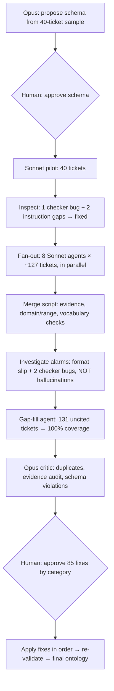

# Project 02: Ontology Forge

> **One-line pitch:** 10 AI agents turn 1,012 raw Jira tickets into a business ontology of 620 entities and 1,235 evidence-backed relationships. A critic agent audits the result, and a human approves every fix.

**Pattern:** Extract → Structure · Fan-out → Merge · Pilot → Scale · Measure → Gap-fill · Draft → Critique → Revise
**Data:** [`ontology/ontology.json`](../../ontology/ontology.json) · [`schema.md`](../../ontology/schema.md) · [`review.md`](../../ontology/review.md) · [`merge_report.md`](../../ontology/merge_report.md)
**Status:** done

---

## Problem
A Jira instance holds years of organizational knowledge (what the product is made of, how it fails, why that matters, who does what), but it's locked in free-text tickets. Nobody can ask *"which components cause the most availability risk?"* The goal: turn tickets into a **structured, evidence-backed model of the business** that people and agents can query.

## Agentic Pattern


## Demo
**The core chain:** *Component → EXHIBITS → Failure Mode → CAUSES → Business Impact*, with every link citing real tickets:
```
interface:log-retention-hours  -EXHIBITS->     failure:config-not-honored      [KAFKA-17584]
failure:config-not-honored     -TRIGGERED_BY-> interface:message-max-bytes     [KAFKA-17584]
failure:config-not-honored     -CAUSES->       impact:data-durability-risk     [KAFKA-17584]
```
*Changing `message.max.bytes` silently resets retention to 7 days, a real data-loss risk found and linked automatically.*

**First insights from the ontology:**
| Question | Answer |
|---|---|
| Most failure-prone components (excluding flaky tests) | RemoteLogManager (tiered storage) 8 · LogCleaner 7 · GroupCoordinator 6 · KRaft Controller 6 |
| Most common failure modes | Incorrect Behavior 98 · API Usability Gap 41 · Crash 40 · Performance Degradation 38 · Missing Observability 37 |
| Strongest failure → business links | Incorrect Behavior → Operational Burden (36 tickets) · Hang → Availability Risk (26) · Data Loss → Durability Risk (24) |

## Prompts I Used
1. ```
   Sample 40 tickets from data/tickets.md and propose an ontology schema (entity types like System, Component, Role, Process, Failure Mode, Business Impact; relationship types) with definitions and examples. Save to ontology/schema.md and stop for my review.
   ```
2. `1. keep all 2. roles only 3. yes 4. yes 5. yes` (**human checkpoint:** schema decisions)
3. `2` (**human checkpoint:** approve critic fixes by category, review the destructive ones)
4. `approve all` (after reviewing the 23 destructive fixes individually)

Every other step (pilot, fan-out, merging, investigating alarms, gap-fill, critic, applying fixes) was run by the orchestrating agent.

## What the Agent Did
| Step | Action | Why |
|---|---|---|
| 1 | Sampled 40 tickets evenly across 2021–2026; drafted a 10-type, 13-relationship schema with controlled vocabularies | Schema-first = consistent extraction |
| 2 | **Human approved the schema** (kept all 10 types, roles not people, fixed vocabularies) | Business judgment lives in the schema |
| 3 | Built `forge.py`: split, vocab, merge (evidence / domain-range / vocabulary checks) | The inspector exists *before* the agents run |
| 4 | Wrote [`EXTRACTION_PROMPT.md`](../../ontology/EXTRACTION_PROMPT.md): shared instructions + canonical IDs | 8 agents must name things identically |
| 5 | **Pilot:** 1 Sonnet agent, 40 tickets → found a checker bug (Systems not recognized) + 2 instruction gaps (labels ignored, interfaces orphaned) | Cheap to find flaws at 40 tickets, expensive at 1,012 |
| 6 | **Fan-out:** 8 Sonnet agents in parallel, ~127 tickets each | Fresh context per batch keeps quality flat |
| 7 | First merge raised **369 "hallucinated citations"** → investigated → one agent wrote `13270` instead of `KAFKA-13270` | An alarm is a question, not a verdict: **155 real facts saved** |
| 8 | Fixed 2 more bugs in *my own checker* (entity-dropping) | Suspect the validator too |
| 9 | Noticed drift: agents skipped 2–35 tickets each under identical rules | Measure, don't trust reports |
| 10 | **Gap-fill:** 1 agent, only the 131 uncited tickets, stricter rule → **100% coverage** | Target the gaps, don't redo everything |
| 11 | **Critic** (Opus, independent): 48 duplicate clusters, evidence audit, 32 schema violations → 85 proposed fixes | The builder shouldn't grade its own work |
| 12 | Spot-checked the critic's claims before presenting them | Verify the critic too |
| 13 | **Human approved** fixes by category and reviewed all 23 destructive ones | Deletions get human eyes |
| 14 | Applied fixes in dependency order → 0 failures, 0 schema problems, 3 orphans cleaned up | Machine-applicable fixes = no reinterpretation |

## Results
| Stage | Entities | Relationships | Ticket coverage | Flags |
|---|---|---|---|---|
| Pilot (40 tickets) | 93 | 91 | 98% | 0 (after checker fix) |
| Fan-out, first merge | 580 | 1,152 | 75% | 369 + 52 |
| After investigating alarms | 661 | 1,307 | 87% | 32 |
| After gap-fill | 680 | 1,339 | 100% | 32 |
| **After critic + human review** | **620** | **1,235** | **99%** | **0** |

**Evidence audit (critic, on the original ticket text):** high/medium-confidence facts were **80% fully supported, 0% unsupported**. Low-confidence facts were only 25% supported, so the agents' confidence labels were honest.

**Cost shape:** ≈1.2M tokens of extraction on Sonnet, ≈210K on Opus for the critic. Model routing put the expensive model only where judgment was needed.

## Vocabulary
| Term | Meaning |
|---|---|
| **Ontology** | A formal model of a domain: types of things, how they relate, and rules |
| **Triple** | One fact as *subject → predicate → object* |
| **Controlled vocabulary** | A fixed list of allowed terms so facts can be counted and compared |
| **Canonical ID** | The one official identifier for a thing, so parallel agents merge cleanly |
| **Domain / range** | Which entity types a relationship may start from and point to |
| **Fan-out → merge** | Split work across parallel agents, then combine |
| **Pilot run** | A small trial to find flaws before the expensive full run |
| **Gap-fill** | Re-processing only what the first pass missed |
| **Critic agent** | An independent reviewer that proposes fixes but doesn't apply them |
| **Entity resolution** | Deciding when two names mean the same thing (`logcleaner` = `log-cleaner`) |
| **Evidence padding** | Citing sources that don't really support a claim, to inflate coverage |
| **Evidence audit** | Checking sampled facts against their sources: supported / weak / unsupported |
| **Model routing** | Cheap models for rule-following bulk work, strong models for judgment |

## Lessons
- **Investigate every alarm before acting.** Two of the three biggest alarms were bugs in my own checker, and the third was a formatting slip. Deleting the flagged data would have destroyed 155 true facts.
- **Pilot first.** 40 tickets exposed 3 problems that would have cost 8 re-runs to fix later.
- **Parallel agents drift.** Identical instructions produced skip rates from 2% to 28%. Measure coverage per batch.
- **Confidence labels work as triage.** Review effort goes to low-confidence facts, where the errors were.
- **Collect structured fields, don't infer them.** Not collecting Jira's `fixVersion` in P1 made release links the weakest part of the ontology. *Next improvement: add fixVersion to the harvester.*
- **At work:** the same pipeline runs on a company Jira by changing the schema's examples and System list. Initiative = Epic, External Dependency = Vendor, Business Impact = what leadership reports on.
