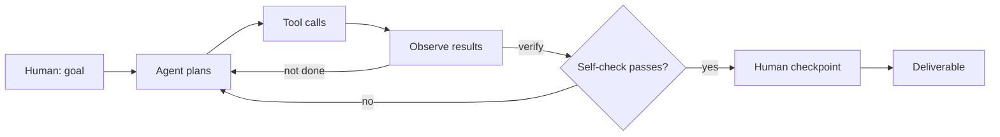

# Project NN: <Name>

> **One-line pitch:** what this does and why someone should care.

**Pattern:** <Gather | Extract→Structure | Fan-out→Merge | Critique→Revise | Monitor→Act | Triage→Route>
**Live demo:** <link to docs/ page, or "n/a">
**Status:** <in progress | done>

---

## Problem
What real-world knowledge or business problem does this solve? Who has the problem, and what does it cost them today?

## Agentic Pattern
How the work flows between me, the agent(s), and the tools.

## Demo
<!-- GIF from vhs, screenshot, or link to live Pages demo -->

## Prompts I Used
The exact prompts, in order. Directing the agent is the skill on display here.

1. `...`
2. `...`

## What the Agent Did
The **tool trace**: the key actions the agent took on its own, including retries and self-corrections.

| Step | Tool / action | Why |
|---|---|---|
| 1 | | |

## Results
Numbers wherever possible: counts, eval scores, time saved, before/after.

## Vocabulary
| Term | Meaning |
|---|---|
| | |

## Lessons
- What worked
- What didn't
- What I'd do differently / how this applies at work
